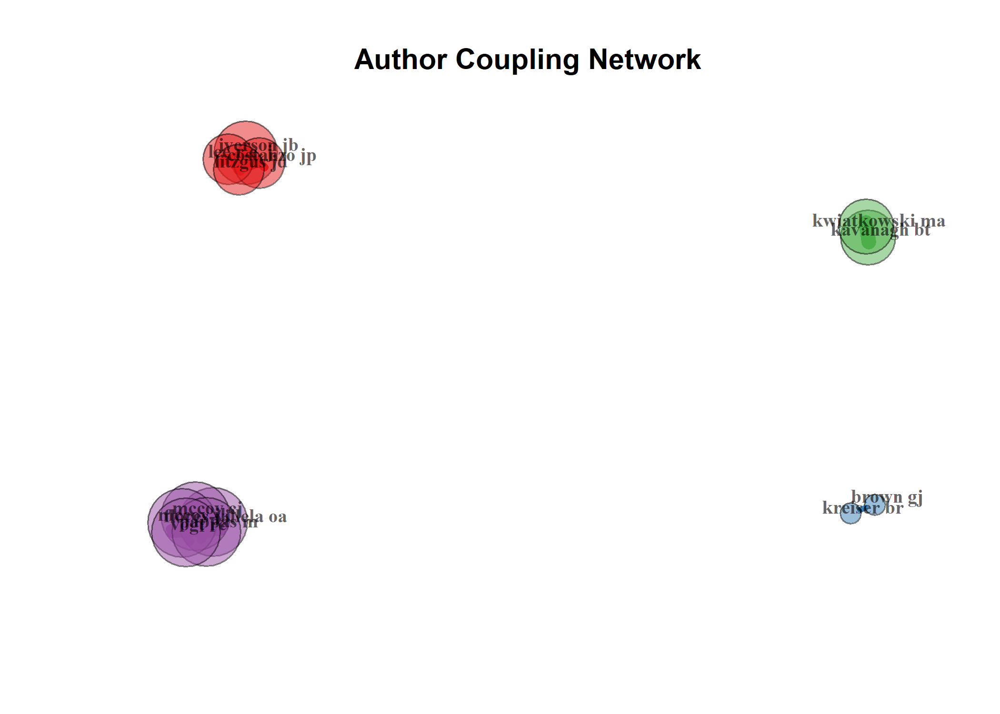
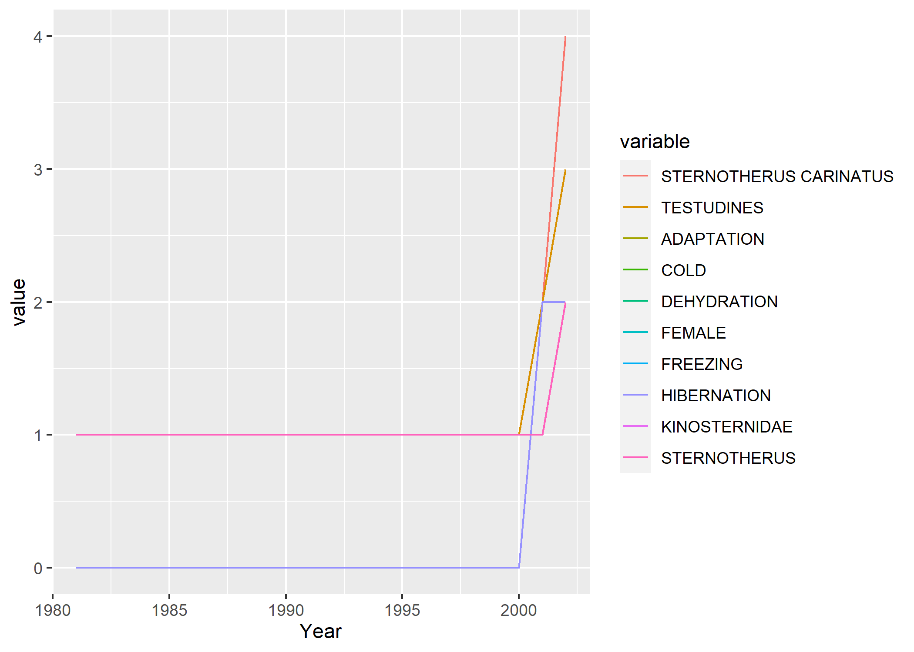
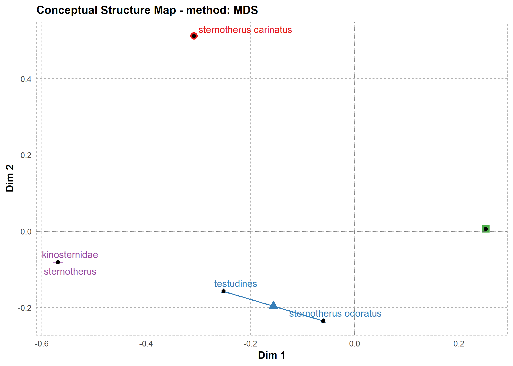
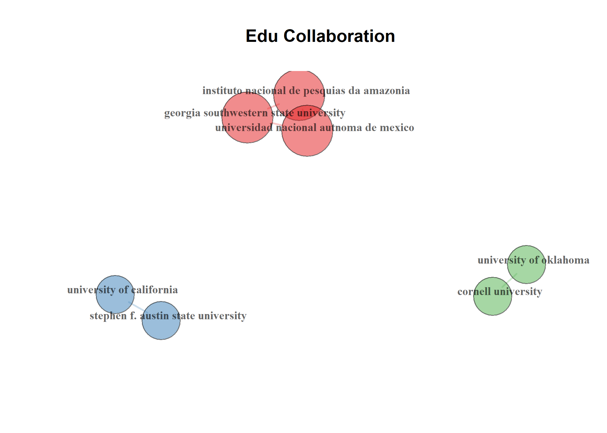

*Sternotherus carinatus*: Literature + bibliometrics
================
Robert Z. Selden, Jr.
25 April, 2021

## Bibliometrics

The dataset used in this analysis was harvested from
[Scopus](https://www.elsevier.com/solutions/scopus), includes all
articles published containing “*Sternotherus carinatus*” OR “razorback
musk turtle” in the title, abtract, or keywords, and the analysis
employs the `bibliometrix` package (Aria and Cuccurullo 2017).

``` r
# install bibliometrix and load data
# install.packages("devtools")
# devtools::install_github("massimoaria/bibliometrix")
library(here)
```

    ## here() starts at D:/github/sc-lit

``` r
library(bibliometrix)
```

    ## To cite bibliometrix in publications, please use:
    ## 
    ## Aria, M. & Cuccurullo, C. (2017) bibliometrix: An R-tool for comprehensive science mapping analysis, 
    ##                                  Journal of Informetrics, 11(4), pp 959-975, Elsevier.
    ##                         
    ## 
    ## https://www.bibliometrix.org
    ## 
    ##                         
    ## For information and bug reports:
    ##                         - Send an email to info@bibliometrix.org   
    ##                         - Write a post on https://github.com/massimoaria/bibliometrix/issues
    ##                         
    ## Help us to keep Bibliometrix free to download and use by contributing with a small donation to support our research team (https://bibliometrix.org/donate.html)
    ## 
    ##                         
    ## To start with the shiny web-interface, please digit:
    ## biblioshiny()

``` r
library(reshape2)
library(ggplot2)
df <- convert2df(file = "scopus.bib", 
                 dbsource = "scopus", 
                 format = "bibtex")
```

    ## 
    ## Converting your scopus collection into a bibliographic dataframe
    ## 
    ## Done!
    ## 
    ## 
    ## Generating affiliation field tag AU_UN from C1:  Done!

## Descriptive analysis

``` r
results <- biblioAnalysis(df, 
                          sep = ";")
options(width = 100)
s <- summary(object = results, 
             k = 10, 
             pause = FALSE)
```

    ## 
    ## 
    ## MAIN INFORMATION ABOUT DATA
    ## 
    ##  Timespan                              1981 : 2020 
    ##  Sources (Journals, Books, etc)        7 
    ##  Documents                             8 
    ##  Average years from publication        12.4 
    ##  Average citations per documents       6.875 
    ##  Average citations per year per doc    0.4642 
    ##  References                            245 
    ##  
    ## DOCUMENT TYPES                     
    ##  article      7 
    ##  note         1 
    ##  
    ## DOCUMENT CONTENTS
    ##  Keywords Plus (ID)                    44 
    ##  Author's Keywords (DE)                11 
    ##  
    ## AUTHORS
    ##  Authors                               18 
    ##  Author Appearances                    19 
    ##  Authors of single-authored documents  3 
    ##  Authors of multi-authored documents   15 
    ##  
    ## AUTHORS COLLABORATION
    ##  Single-authored documents             3 
    ##  Documents per Author                  0.444 
    ##  Authors per Document                  2.25 
    ##  Co-Authors per Documents              2.38 
    ##  Collaboration Index                   3 
    ##  
    ## 
    ## Annual Scientific Production
    ## 
    ##  Year    Articles
    ##     1981        1
    ##     2001        1
    ##     2002        1
    ##     2013        1
    ##     2016        2
    ##     2020        2
    ## 
    ## Annual Percentage Growth Rate 1.793188 
    ## 
    ## 
    ## Most Productive Authors
    ## 
    ##       Authors        Articles Authors        Articles Fractionalized
    ## 1  IVERSON JB               2 IVERSON JB                       1.250
    ## 2  ATKINSON CL              1 ATKINSON CL                      1.000
    ## 3  BROWN GJ                 1 GODWIN CD                        1.000
    ## 4  COSTANZO JP              1 BROWN GJ                         0.500
    ## 5  FLORES-VILLELA OA        1 KAVANAGH BT                      0.500
    ## 6  GODWIN CD                1 KREISER BR                       0.500
    ## 7  KAVANAGH BT              1 KWIATKOWSKI MA                   0.500
    ## 8  KREISER BR               1 LUCCHINO RV                      0.333
    ## 9  KWIATKOWSKI MA           1 REYNOLDS SL                      0.333
    ## 10 LEE R.E. J               1 SEIDEL ME                        0.333
    ## 
    ## 
    ## Top manuscripts per citations
    ## 
    ##                              Paper                             DOI TC TCperYear NTC
    ## 1  COSTANZO JP, 2001, PHYSIOL BIOCHEM ZOOL  10.1086/322161         24     1.143   1
    ## 2  SEIDEL ME, 1981, HERPETOLOGICA           NA                     12     0.293   1
    ## 3  IVERSON JB, 2002, SOUTHWEST NAT          10.2307/3672909        10     0.500   1
    ## 4  ATKINSON CL, 2013, HERPETOL CONSERV BIOL NA                      7     0.778   1
    ## 5  MCCOY CJ, 2020, CHELONIAN CONSERV BIOL   10.2744/CCB-1447.1      2     1.000   2
    ## 6  BROWN GJ, 2020, CHELONIAN CONSERV BIOL   10.2744/CCB-1424.1      0     0.000   0
    ## 7  KAVANAGH BT, 2016, SOUTHEAST NAT         10.1656/058.015.0SP914  0     0.000 NaN
    ## 8  GODWIN CD, 2016, HERPETOL REV            NA                      0     0.000 NaN
    ## 9  NA                                       NA                     NA        NA  NA
    ## 10 NA                                       NA                     NA        NA  NA
    ## 
    ## 
    ## Corresponding Author's Countries
    ## 
    ##   Country Articles  Freq SCP MCP MCP_Ratio
    ## 1  USA           6 0.857   6   0         0
    ## 2  BRAZIL        1 0.143   0   1         1
    ## 
    ## 
    ## SCP: Single Country Publications
    ## 
    ## MCP: Multiple Country Publications
    ## 
    ## 
    ## Total Citations per Country
    ## 
    ##   Country      Total Citations Average Article Citations
    ## 1       USA                 41                      6.83
    ## 2       BRAZIL               2                      2.00
    ## 
    ## 
    ## Most Relevant Sources
    ## 
    ##                            Sources        Articles
    ## 1 CHELONIAN CONSERVATION AND BIOLOGY             2
    ## 2 HERPETOLOGICA                                  1
    ## 3 HERPETOLOGICAL CONSERVATION AND BIOLOGY        1
    ## 4 HERPETOLOGICAL REVIEW                          1
    ## 5 PHYSIOLOGICAL AND BIOCHEMICAL ZOOLOGY          1
    ## 6 SOUTHEASTERN NATURALIST                        1
    ## 7 SOUTHWESTERN NATURALIST                        1
    ## 
    ## 
    ## Most Relevant Keywords
    ## 
    ##                    Author Keywords (DE)      Articles Keywords-Plus (ID)     Articles
    ## 1  CAHABA RIVER                                     1 STERNOTHERUS CARINATUS        4
    ## 2  CHICKASAWHAY RIVER                               1 TESTUDINES                    3
    ## 3  CORBICULA FLUMINEA                               1 ADAPTATION                    2
    ## 4  DIET ANALYSIS                                    1 COLD                          2
    ## 5  DIET DIVERSITY                                   1 DEHYDRATION                   2
    ## 6  GEOGRAPHICAL INFORMATIONAL SYSTEMS (GIS)         1 FEMALE                        2
    ## 7  GRAPTEMYS                                        1 FREEZING                      2
    ## 8  INVASIVE SPECIES                                 1 HIBERNATION                   2
    ## 9  NONMETRIC MULTIDIMENSIONAL SCALING (NMDS)        1 KINOSTERNIDAE                 2
    ## 10 OKLAHOMA                                         1 STERNOTHERUS                  2

``` r
# plot attributes
plot(x = results, 
     k = 10, 
     pause = FALSE)
```

<!-- --><!-- --><!-- --><!-- --><!-- -->

### Attributes of the local network

``` r
# calculate citations in local network
CR <- localCitations(df, sep = ";")

# top 10 cited authors in local network
CR$Authors[1:10,]
```

    ##               Author LocalCitations
    ## 5          GODWIN CD              1
    ## 1        ATKINSON CL              0
    ## 2           BROWN GJ              0
    ## 3        COSTANZO JP              0
    ## 4  FLORES-VILLELA OA              0
    ## 6         IVERSON JB              0
    ## 7        KAVANAGH BT              0
    ## 8         KREISER BR              0
    ## 9     KWIATKOWSKI MA              0
    ## 10        LEE R.E. J              0

``` r
# top 10 cited papers in local network
CR$Papers[1:10,]
```

    ##                                         Paper                    DOI Year LCS GCS
    ## 5    ATKINSON CL, 2013, HERPETOL CONSERV BIOL                        2013   1   7
    ## 1      MCCOY CJ, 2020, CHELONIAN CONSERV BIOL     10.2744/CCB-1447.1 2020   0   2
    ## 2      BROWN GJ, 2020, CHELONIAN CONSERV BIOL     10.2744/CCB-1424.1 2020   0   0
    ## 3            KAVANAGH BT, 2016, SOUTHEAST NAT 10.1656/058.015.0SP914 2016   0   0
    ## 4               GODWIN CD, 2016, HERPETOL REV                        2016   0   0
    ## 6             IVERSON JB, 2002, SOUTHWEST NAT        10.2307/3672909 2002   0  10
    ## 7     COSTANZO JP, 2001, PHYSIOL BIOCHEM ZOOL         10.1086/322161 2001   0  24
    ## 8              SEIDEL ME, 1981, HERPETOLOGICA                        1981   0  12
    ## NA                                       <NA>                   <NA>   NA  NA  NA
    ## NA.1                                     <NA>                   <NA>   NA  NA  NA

## Most cited

### Most cited articles

``` r
# most cited references in global network
mcr <- citations(df, 
                 field = "article", 
                 sep = ";")
cbind(mcr$Cited[1:20])
```

    ##                                                                                                                                                                                                                                                                                   [,1]
    ## IVERSON, J.B., REPRODUCTION IN THE MEXICAN MUD TURTLE KINOSTERNON INTEGRUM (1999) JOURNAL OF HERPETOLOGY, 33, PP. 144-148                                                                                                                                                            2
    ## MAHMOUD, I.Y., FEEDING BEHAVIOR IN KINOSTERNID TURTLES (1968) HERPETOLOGICA, 24, PP. 300-305                                                                                                                                                                                         2
    ## (1967) CALORIFIC EQUIVALENTS FOR STUDIES IN ECOLOGICAL ENERGETICS, P. 54. , CUMMINS. K.W. SECOND EDITION. PITTSBURGH, PA: PYMATUNING LABORATORY OF ECOLOGY, UNIVERSITY OF PITTSBURGH                                                                                                 1
    ## (2012) NUISANCE AQUATIC SPECIES DATABASE, , HTTP://NAS.ER.USGS.GOV/, USGS. UNITED STATES DEPARTMENT OF THE INTERIOR, WASHINGTON, D.C., USA. AVAILABLE AT18 JANUARY 2014 (LAST ACCESSED                                                                                               1
    ## (2012) R: A LANGUAGE AND ENVIRONMENT FOR STATISTICAL COMPUTING, , R DEVELOPMENT CORE TEAM. R FOUNDATION FOR STATISTICAL COMPUTING, VIENNA, AUSTRIA                                                                                                                                   1
    ## A REVIEW OF THE ADAPTIVE STRATEGY USED BY HATCHLING PAINTED TURTLES TO SURVIVE COLD STRESS (1995) HERPETOL REV, 26, PP. 8-11                                                                                                                                                         1
    ## AHLE, R.C., (1991) A STUDY OF THREE CREEKS IN NACOGDOCHES COUNTY, TEXAS USING AN INDEX OF BIOLOGICAL DIVERSITY, , M.SC. THESIS. STEPHEN F. AUSTIN STATE UNIVERSITY, NACOGDOCHES, TX                                                                                                  1
    ## ALCALDE, L., DEROCCO, N.N., ROSSET, S.D., FEEDING IN SYNTOPY: DIET OF HYDROMEDUSA TECTIFERA AND PHRYNOPS HILARII (CHELIDAE) (2010) CHELONIAN CONSERVATION AND BIOLOGY, 9, PP. 33-44                                                                                                  1
    ## ATKINSON, C.A., RAZOR-BACKED MUSK TURTLE (STERNOTHERUS CARINATUS) DIET ACROSS A GRADIENT OF INVASION (2013) HERPETOLOGICAL CONSERVATION AND BIOLOGY, 8, PP. 561-570                                                                                                                  1
    ## ATKINSON, C.L., FIRST, M.R., COVICH, A.P., OPSAHL, S.P., GOLLADAY, S.W., SUSPENDED MATERIAL AVAILABILITY AND FILTRATIONBIODEPOSITION PROCESSES PERFORMED BY A NATIVE AND INVASIVE BIVALVE SPECIES IN STREAMS (2011) HYDROBIOLOGIA, 667, PP. 191-204                                  1
    ## ATKINSON, C.L., OPSAHL, S.P., COVICH, A.P., GOLLADAY, S.W., CONNER, L.M., STABLE ISOTOPIC SIGNATURES, TISSUE STOICHIOMETRY, AND NUTRIENT CYCLING (C AND N) OF NATIVE AND INVASIVE FRESHWATER BIVALVES (2010) JOURNAL OF THE NORTH AMERICAN BENTHOLOGICAL SOCIETY, 29, PP. 496-505    1
    ## AUFFENBERG, W., DISPLAY BEHAVIOR IN TORTOISES (1977) AMERICAN ZOOLOGIST, 17, PP. 241-250                                                                                                                                                                                             1
    ## AUFFENBERG, W., WEAVER, W.G., JR., GOPHERUS BERLANDIERI IN SOUTHEASTERN TEXAS (1969) BULLETIN OF FLORIDA STATE MUSEUM OF BIOLOGICAL SCIENCE, 13, PP. 141-203                                                                                                                         1
    ## BARZILAY, S., AGGRESSIVE BEHAVIOR IN THE WOOD TURTLE, CLEMMYS INSCULPTA (1980) JOURNAL OF HERPETOLOGY, 14, PP. 89-91                                                                                                                                                                 1
    ## BEAUPRE, S.J., JACOBSON, E.R., LILLYWHITE, H.B., ZAMUDIO, K., (2004) GUIDELINES FOR THE USE OF LIVE AMPHIBIANS AND REPTILES IN FIELD AND LABORATORY RESEARCH, P. 43. , SECOND EDITION. AMERICAN SOCIETY OF ICHTHYOLOGISTS AND HERPETOLOGISTS                                         1
    ## BECKER, H., BEOBACHTUNGEN BEI DER HALTUNG UND NACHZUCHT VON STERNOTHERUS CARINATUS (GRAY 1856) (1992) SALAMANDRA, 28, PP. 9-13                                                                                                                                                       1
    ## BENTLEY, P.J., SCHMIDT-NIELSEN, K., CUTANEOUS WATER LOSS IN REPTILES (1966) SCIENCE, 151, PP. 1547-1549                                                                                                                                                                              1
    ## BERRY, J.F., POPULATION EFFECTS OF ECOLOGICAL SYMPATRY ON MUSK TURTLES IN NORTHERN FLORIDA (1975) COPEIA, 1975, PP. 692-701                                                                                                                                                          1
    ## BERRY, J.F., SHINE, R., SEXUAL SIZE-DIMORPHISM AND SEXUAL SELECTION IN TURTLES (ORDER TESTUDINES) (1980) OECOLOGIA (BERLIN), 44, PP. 185-191                                                                                                                                         1
    ## BERRY, J.F., THE POPULATION EFFECTS OF ECOLOGICAL SYMPATRY ON MUSK TURTLES IN NORTHERN FLORIDA (1975) COPEIA, 1975, PP. 692-700                                                                                                                                                      1

### Most cited authors

``` r
# most cited authors in global network
mcr <- citations(df, 
                 field = "author", 
                 sep = ";")
cbind(mcr$Cited[1:20])
```

    ##               [,1]
    ## IVERSON J B     15
    ## GIBBONS J W     12
    ## LINDEMAN P V    12
    ## CONGDON J D     11
    ## VOGT R C        10
    ## LOVICH J E       8
    ## ERNST C H        7
    ## MAHMOUD I Y      7
    ## BROOKS R J       5
    ## COSTANZO J P     5
    ## LEE R E          5
    ## TINKLE D W       5
    ## GALBRAITH D A    4
    ## LITZGUS J D      4
    ## PACKARD G C      4
    ## PACKARD M J      4
    ## SCHOENER T W     4
    ## SHINE R          4
    ## BARBOUR R W      3
    ## BERRY J F        3

### Author dominance ranking

``` r
dom <- biblioAnalysis(df)
dom.r <- dominance(dom)
dom.r
```

    ##         Author Dominance Factor Tot Articles Single-Authored Multi-Authored First-Authored Rank by Articles Rank by DF
    ## 1     BROWN GJ                1            1               0              1              1                1          1
    ## 2  COSTANZO JP                1            1               0              1              1                1          1
    ## 3  KAVANAGH BT                1            1               0              1              1                1          1
    ## 4     MCCOY CJ                1            1               0              1              1                1          1
    ## 5    SEIDEL ME                1            1               0              1              1                1          1
    ## 6         <NA>               NA           NA              NA             NA             NA                6          6
    ## 7         <NA>               NA           NA              NA             NA             NA                7          7
    ## 8         <NA>               NA           NA              NA             NA             NA                8          8
    ## 9         <NA>               NA           NA              NA             NA             NA                9          9
    ## 10        <NA>               NA           NA              NA             NA             NA               10         10

## Intellectual structure

### Author co-citation

Co-citation analysis is the most commonly used bibliometric analysis
method (Ding, Chowdhury, and Foo 2001), and is defined as two
publications that are cited together in one article (Small 1973).

``` r
# extract author names from reference items
df <- metaTagExtraction(df,
                        Field = "CR_AU")

# author co-citation network
auth.co.mat <- biblioNetwork(df, 
                             analysis = "co-citation", 
                             network = "authors", 
                             sep = ";")

# network plot
auth.co.net = networkPlot(auth.co.mat, 
                          n = 50, 
                          Title = "Author Co-Citation Network", 
                          type = "auto", 
                          size = 20, 
                          size.cex = T, 
                          remove.multiple = FALSE, 
                          labelsize = 0.5, 
                          edgesize = 8, 
                          edges.min = 3, 
                          remove.isolates = TRUE)
```


``` r
# descriptive analysis of author co-citation network
auth.co.netstat <- networkStat(auth.co.mat)
summary(auth.co.netstat, k = 15)
```

    ## 
    ## 
    ## Main statistics about the network
    ## 
    ##  Size                                  172 
    ##  Density                               0.246 
    ##  Transitivity                          0.799 
    ##  Diameter                              3 
    ##  Degree Centralization                 0.544 
    ##  Average path length                   1.863 
    ## 

### Author coupling

Coupling is a similarity measure that uses citation analysis to
illustrate a similarity relationship between documents. Author coupling
occurs when two authors reference a common third author in their
bibliographies.

``` r
# author coupling network
auth.co.mat <- biblioNetwork(df, 
                             analysis = "coupling", 
                             network = "authors", 
                             sep = ";")

# network plot
auth.co.net = networkPlot(auth.co.mat, 
                          n = 50, 
                          Title = "Author Coupling Network", 
                          type = "auto", 
                          size = 20, 
                          size.cex = T, 
                          remove.multiple = FALSE, 
                          labelsize = 0.8, 
                          edgesize = 10, 
                          edges.min = 8, 
                          remove.isolates = TRUE)
```



``` r
# descriptive analysis of author coupling network
auth.co.netstat <- networkStat(auth.co.mat)
summary(auth.co.netstat, k = 15)
```

    ## 
    ## 
    ## Main statistics about the network
    ## 
    ##  Size                                  18 
    ##  Density                               0.222 
    ##  Transitivity                          0.642 
    ##  Diameter                              4 
    ##  Degree Centralization                 0.366 
    ##  Average path length                   1.813 
    ## 

## Historiograph direct citation linkages

The historiographic map is a chronological network map of the most
relevant direct citations resulting from this bibliographic collection.

``` r
# historical citation network
options(width = 100)
histResults <- histNetwork(df, 
                           min.citations = 1, 
                           sep = ";")
```

    ## 
    ## SCOPUS DB: Searching local citations (LCS) by document titles (TI) and DOIs...
    ## 
    ## Found 1 documents with no empty Local Citations (LCS)

``` r
# plot historical co-citation network
hnet <- histPlot(histResults, 
                 n = 500, 
                 size = 6, 
                 labelsize = 4)
```


    ## 
    ##  Legend
    ## 
    ##                                      Label                    DOI Year LCS GCS
    ## 1 ATKINSON CL, 2013, HERPETOL CONSERV BIOL                        2013   1   7
    ## 2         KAVANAGH BT, 2016, SOUTHEAST NAT 10.1656/058.015.0SP914 2016   0   0

### Yearly occurrences of top keywords/terms

``` r
topKW = KeywordGrowth(df, 
                      Tag = "ID", 
                      sep = ";", 
                      top=10, 
                      cdf=TRUE)

topKW
```

    ##    Year STERNOTHERUS CARINATUS TESTUDINES ADAPTATION COLD DEHYDRATION FEMALE FREEZING HIBERNATION
    ## 1  1981                      1          1          0    0           0      0        0           0
    ## 2  1982                      1          1          0    0           0      0        0           0
    ## 3  1983                      1          1          0    0           0      0        0           0
    ## 4  1984                      1          1          0    0           0      0        0           0
    ## 5  1985                      1          1          0    0           0      0        0           0
    ## 6  1986                      1          1          0    0           0      0        0           0
    ## 7  1987                      1          1          0    0           0      0        0           0
    ## 8  1988                      1          1          0    0           0      0        0           0
    ## 9  1989                      1          1          0    0           0      0        0           0
    ## 10 1990                      1          1          0    0           0      0        0           0
    ## 11 1991                      1          1          0    0           0      0        0           0
    ## 12 1992                      1          1          0    0           0      0        0           0
    ## 13 1993                      1          1          0    0           0      0        0           0
    ## 14 1994                      1          1          0    0           0      0        0           0
    ## 15 1995                      1          1          0    0           0      0        0           0
    ## 16 1996                      1          1          0    0           0      0        0           0
    ## 17 1997                      1          1          0    0           0      0        0           0
    ## 18 1998                      1          1          0    0           0      0        0           0
    ## 19 1999                      1          1          0    0           0      0        0           0
    ## 20 2000                      1          1          0    0           0      0        0           0
    ## 21 2001                      2          2          2    2           2      2        2           2
    ## 22 2002                      4          3          2    2           2      2        2           2
    ##    KINOSTERNIDAE STERNOTHERUS
    ## 1              1            1
    ## 2              1            1
    ## 3              1            1
    ## 4              1            1
    ## 5              1            1
    ## 6              1            1
    ## 7              1            1
    ## 8              1            1
    ## 9              1            1
    ## 10             1            1
    ## 11             1            1
    ## 12             1            1
    ## 13             1            1
    ## 14             1            1
    ## 15             1            1
    ## 16             1            1
    ## 17             1            1
    ## 18             1            1
    ## 19             1            1
    ## 20             1            1
    ## 21             1            1
    ## 22             2            2

``` r
# plot results
key.plot = melt(topKW, 
                id='Year')

ggplot(key.plot, aes(Year, 
                     value, 
                     group = variable, 
                     color = variable)) + 
  geom_line()
```



## Conceptual structure

### Co-word analysis

The co-word analysis maps the conceptual structure of a research domain
using the co-occurrence of author keywords in the bibliographic
collection.

``` r
# using authors keywords
cw <- conceptualStructure(df, 
                          field = "ID", 
                          method = "MDS", 
                          minDegree = 2, 
                          clust = "auto", 
                          stemming = FALSE, 
                          labelsize = 10, 
                          documents = 15)
```



## Social structure

### Author collaboration

Scientific collaborations are plotted where nodes are authors and links
are co-authorships, illustrating collaborations between authors.

``` r
# author collaboration network
auth.collab <- biblioNetwork(df, 
                             analysis = "collaboration", 
                             network = "authors", 
                             sep = ";")

# network plot
auth.collabnet = networkPlot(auth.collab, 
                             n = 100, 
                             Title = "Author Collaboration", 
                             type = "auto", 
                             size = 15, 
                             size.cex = T, 
                             edgesize = 2, 
                             labelsize = 0.8, 
                             remove.isolates = TRUE)
```


``` r
# descriptive analysis of author collaboration network
auth.collab.netstat <- networkStat(auth.collab)
summary(auth.collab.netstat, k = 15)
```

    ## 
    ## 
    ## Main statistics about the network
    ## 
    ##  Size                                  18 
    ##  Density                               0.137 
    ##  Transitivity                          1 
    ##  Diameter                              1 
    ##  Degree Centralization                 0.098 
    ##  Average path length                   1 
    ## 

### Edu collaboration

Scientific collaborations are plotted where nodes are institutions and
links are co-authorships, illustrating collaborations between
institutions.

``` r
# author collaboration network
edu.collab <- biblioNetwork(df, 
                            analysis = "collaboration", 
                            network = "universities",
                            sep = ";")

# network plot
edu.collabnet = networkPlot(edu.collab, 
                            n = 75, 
                            Title = "Edu Collaboration", 
                            type = "auto", 
                            size = 25, 
                            size.cex = T, 
                            edgesize = 2, 
                            labelsize = 0.8, 
                            remove.isolates = TRUE)
```



``` r
# descriptive analysis of edu collaboration network
edu.collab.netstat<-networkStat(edu.collab)
summary(edu.collab.netstat, k = 15)
```

    ## 
    ## 
    ## Main statistics about the network
    ## 
    ##  Size                                  12 
    ##  Density                               0.076 
    ##  Transitivity                          1 
    ##  Diameter                              1 
    ##  Degree Centralization                 0.106 
    ##  Average path length                   1 
    ## 

## References cited

<div id="refs" class="references csl-bib-body hanging-indent">

<div id="ref-RN20997" class="csl-entry">

Aria, Massimo, and Corrado Cuccurullo. 2017. “Bibliometrix : An r-Tool
for Comprehensive Science Mapping Analysis.” *Journal of Informetrics*
11 (4): 959–75. <https://doi.org/10.1016/j.joi.2017.08.007>.

</div>

<div id="ref-RN20999" class="csl-entry">

Ding, Ying, Gobinda G. Chowdhury, and Schubert Foo. 2001. “Bibliometric
Cartography of Information Retrieval Research by Using Co-Word
Analysis.” *Information Processing & Management* 37 (6): 817–42.
<https://doi.org/10.1016/s0306-4573(00)00051-0>.

</div>

<div id="ref-RN21000" class="csl-entry">

Small, Henry. 1973. “Co-Citation in the Scientific Literature: A New
Measure of the Relationship Between Two Documents.” *Journal of the
American Society for Information Science* 24 (4): 265–69.
<https://doi.org/10.1002/asi.4630240406>.

</div>

</div>
